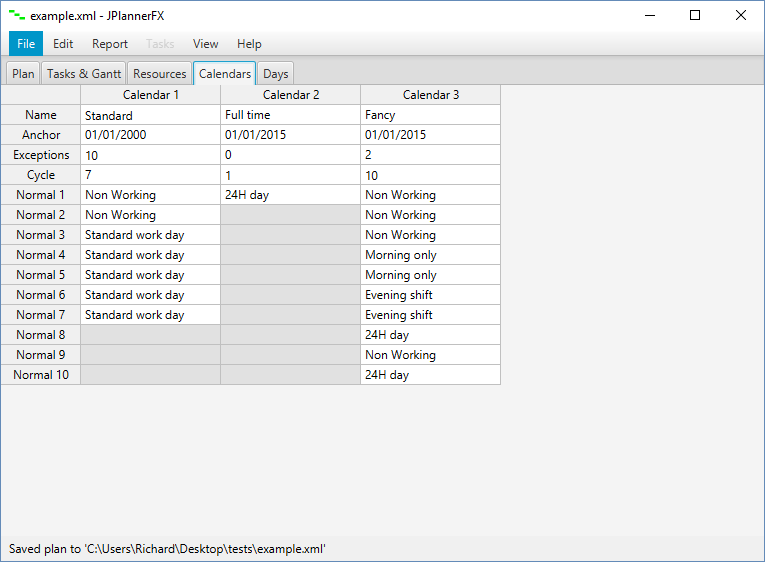

# JPlannerFX

A graphical project planning tool similar to M$Project.


The screenshot above shows the 'Plan' tab that allows the user to view and modify basic plan parameters.

## Getting Started

To enter the plan tasks simply enter into the Tasks table on the 'Tasks & Gantt' tab.


Plan resources can be created and edited using the table on the 'Resources' tab.


Plan calendars used to define resource availability can be created and edited using the table on the 'Calendars' tab.



Calendars use day-types can be created and edited using the table on the 'Days' tab.


Modifications to the plan are recorded on an undostack which can be viewed and interacted with.


### Prerequisites

The application has been written in Java using the JavaFX GUI library, so a recent Java runtime environment needs to be installed on your machine.

```
Java version 8 (or later)
```

### Installing

Simply copy the application JAR file to the location of your choice on your machine, and execute.

```
JPlannerFX.jar
```

## Built With

* [Java](https://www.oracle.com/java/) - General-purpose computer programming language
* [JavaFX](https://docs.oracle.com/javafx/) - Used to generate interactive graphical interface 
* [Eclipse](https://www.eclipse.org) - Integrated development environment (IDE) used to develop the application
